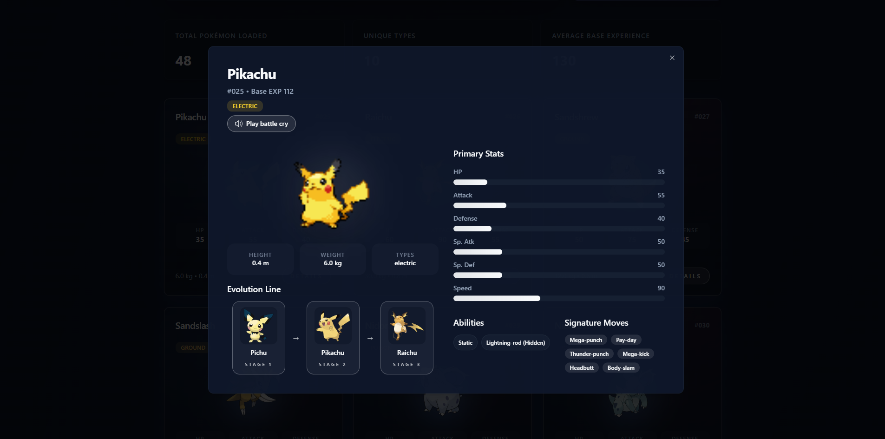

[](https://classroom.github.com/a/gXKuYzJA)
## Learning about Fundamental FrontEnd Developer

### Nama: Rama Syailana Dewa

### Deploy Link : https://fe-pokemon-masdewaa.vercel.app/ 

# PokeDewa Explorer (React + shadcn/ui)

## Overview

PokeDewa Explorer is a React + Vite single-page interface that showcases Pokemon data fetched from the public [PokeAPI](https://pokeapi.co/api/v2/pokemon). The experience is built with Tailwind CSS and shadcn/ui components to deliver a modern dashboard, insight cards, powerful filtering, and a detail modal with rich stats and attributes.

## Tech Stack & Libraries

| Layer | Library | Purpose |
| --- | --- | --- |
| UI framework | React 18 | Component-based SPA rendering and state management |
| Build tool | Vite 7 | Fast development server, HMR, and production bundling |
| Styling | Tailwind CSS 3 | Utility-first styling and design tokens |
| Component system | shadcn/ui | Accessible Radix primitives with Tailwind styling |
| Primitive bindings | Radix UI packages | Dialog, Select, Switch, Scroll Area behaviours |
| Utility helpers | class-variance-authority & tailwind-merge | Composable class variants and conflict-free Tailwind class merging |
| Type utilities | clsx | Conditional class name composition |

## Getting Started

```bash
# install dependencies
npm install

# start local dev server
npm run dev

# run type check + production build
npm run build

# preview the built output
npm run preview
```

The app will be available at http://localhost:5173 in development. Ensure a stable internet connection for live [PokeAPI](https://pokeapi.co/) requests.

## Project Structure

```text
src/
  components/
    pokemon/        // Dashboard-specific UI building blocks
    ui/             // shadcn/ui primitives (button, card, dialog, ...)
  constants/        // Pokemon type color mapping
  lib/              // API client helpers and shared utilities
  styles/           // Tailwind entrypoint with CSS variables
  types/            // Shared TypeScript contracts
  App.tsx           // Root dashboard composition
  main.tsx          // React entry point
```

## Screenshots

| Dashboard | Detail Modal |
| --- | --- |
|  |  |

## API Usage Notes

- Pokemon are fetched in batches of 24 using [https://pokeapi.co/api/v2/pokemon](https://pokeapi.co/api/v2/pokemon) and individual detail endpoints.
- Type filters are dynamically populated from [https://pokeapi.co/api/v2/type](https://pokeapi.co/api/v2/type), excluding `shadow` and `unknown` categories.
- Basic error handling surfaces a retry button if network requests fail.

## Accessibility & UX Considerations

- shadcn/ui components provide keyboard-friendly and screen-reader-aware primitives (Dialog, Select, Switch).
- Color tokens and gradients honor both light and dark themes for readable contrast.
- Loading skeletons maintain layout stability while asynchronous data resolves.
